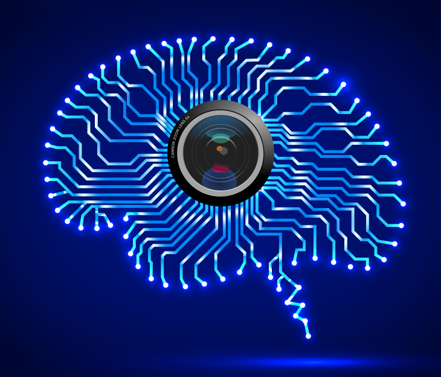

# dl_lib is a simple deep learning library from scratch 

## Contents of the library - (Still Working)
* Tensors
* Loss Functions
* Layers
* Neural Nets
* Optimizers
* Data 
* Training
* End to end example(s)

